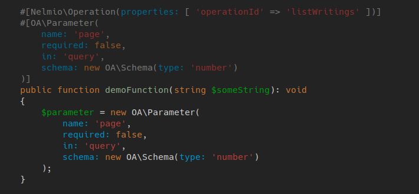

# PHP Attributes Syntax

This syntax file adds syntax/highlighting groups for PHP 8
[attributes](https://www.php.net/manual/en/language.attributes.overview.php). I wrote this as an
addition to the official Vim php syntax which lacks attributes.

## Example



## Installation

Either copy the file keeping the directory structure to your `.vim` home directory or use a plugin
manager.

Plug:
```
Plug 'dr0bz/php-attributes-syntax'
```

## Usage

This syntax will introduce few new groups and link them to standard vim sytnax groups:

|New Group|Linked To|
|:---------------------------|----------------|
|phpAttributeKeyword        |        Keyword  |
|phpAttributeClassKeyword   |        Keyword  |
|phpAttributeBoolean        |        Boolean  |
|phpAttributeNumber         |        Number   |
|phpAttributeConstant       |        Constan  |
|phpAttributeString         |        String   |
|phpAttributeNamedArgument  |        Normal   |
|phpAttributeFQDN           |        Normal   |
|phpAttributeInitClassName  |        Normal   |
|phpAttributeClassName      |        Normal   |
|phpAttributeBlock          |        Comment  |

You probably want colors that are less intrusive. Since attributes a written in the comment place.
You can just take your regular colors and make them darker. For ex. here is my color of `Keyword`:

 `#cc7833`

Find your's:

```
hi Keyword
```

Then use your color picker to make it a bit darker:

 `#995924`


```
hi phpAttributeKeyword guifg=#995924
```

Do this to all attribute groups mentioned above.

<br>
<br>
<br>

**Good luck and happy coding in vim:)**

